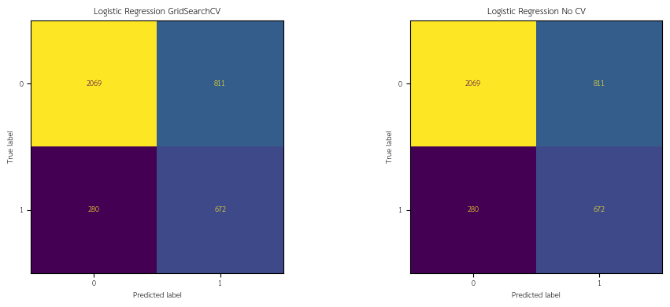
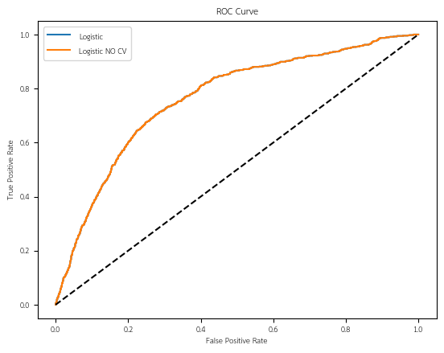
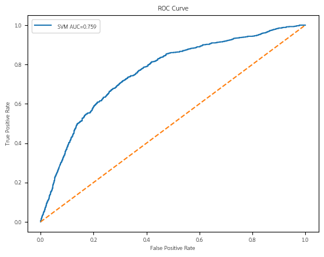
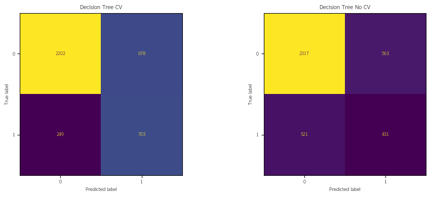
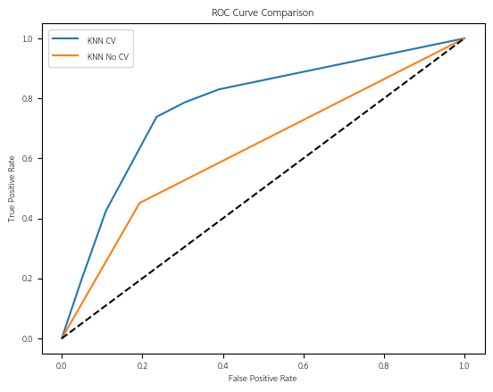
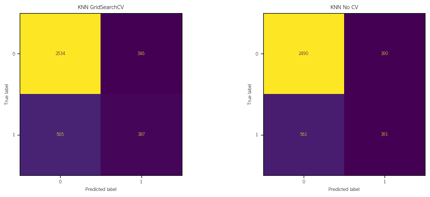
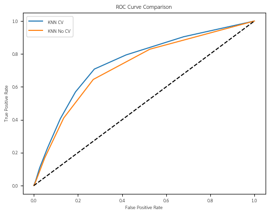
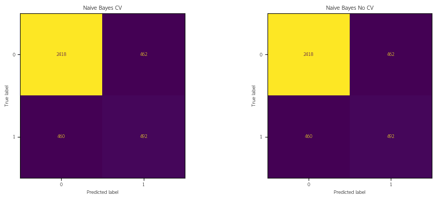
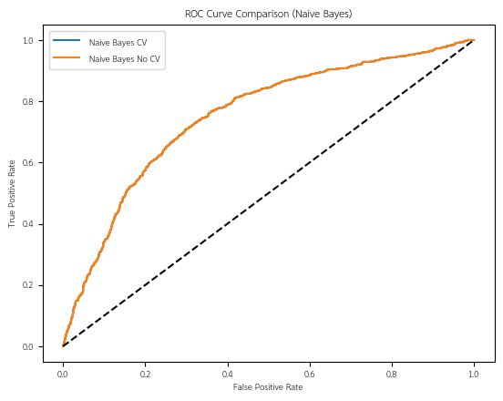
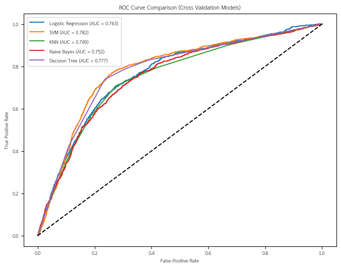

# 🧑‍💼 Job Change Prediction Model
โปรเจกต์นี้เป็นการวิเคราะห์ข้อมูลเชิงสำรวจ (Exploratory Data Analysis: EDA) และสร้างโมเดล Machine Learning สำหรับการพยากรณ์การเปลี่ยนงานของพนักงาน (JobChange Prediction)
โดยใช้ข้อมูลเชิงบุคคล ระดับการศึกษา ประสบการณ์ทำงาน ประเภทบริษัท ไปจนถึงข้อมูลเชิงพื้นที่ เช่น ดัชนีพัฒนาเมือง

---

## 🏙️ Background
- ชุดข้อมูลประกอบไปด้วย
  - ข้อมูลการย้ายงานของพนักงาน รวมถึงปัจจัยต่าง ๆ ทั้งหมด 19,158 record
  - ตัวแปรเป้าหมาย คือ JobChange (0 = ไม่เปลี่ยนงาน, 1 = เปลี่ยนงาน) 
  - พบว่ามี class imbalance ของ JobChange อย่างชัดเจน ดังนี้ 0 = 75.07% และ 1 = 24.93%
  - ปัจจัยด้านต่าง ๆ เช่น ระดับการศึกษา (education_level) ประสบการณ์ทำงาน (experience) ความสอดคล้องของงานกับประสบการณ์ (relevant_experience) เป็นต้น
  - Data Sources ข้อมูลจาก [www.kaggle.com](https://www.kaggle.com/datasets/arashnic/hr-analytics-job-change-of-data-scientists)

---

## ❓ Problem Statement
องค์กรจำนวนมากมีอัตราการลาออกของพนักงานสูง ซึ่งส่งผลให้เกิดต้นทุนด้านการสรรหา การอบรม และสูญเสียผลผลิตอย่างมีนัยสำคัญ 
การคาดการณ์ความเป็นไปได้ที่พนักงานจะเปลี่ยนงานล่วงหน้าจึงเป็นสิ่งสำคัญต่อการวางแผนด้านทรัพยากรบุคคลและกลยุทธ์การรักษาพนักงาน (Retention Strategy)

---

## 🎯 Objectives/SMART Objectives
**Objectives**
1. ทำความสะอาดข้อมูลและจัดเตรียมข้อมูลให้พร้อมสำหรับการสร้างโมเดล
2. วิเคราะห์คุณสมบัติของข้อมูลและความสัมพันธ์ของการเปลี่ยนงานของพนักงาน
3. ทดสอบสมมติฐานเพื่อประเมินปัจจัยที่มีศักยภาพในการทำนาย
4. สร้างโมเดลสำหรับการพยากรณ์การเปลี่ยนงานของพนักงาน โดยใช้ Logistic Regression และ SVM
5. วัดและประเมินผลโมเดลด้วย Confusion Matrix, Precision-Recall, F1 Score และ ROC‑AUC

**SMART Objectives**

พัฒนาแบบจำลองเชิงทำนายเพื่อประเมินความน่าจะเป็นในการเปลี่ยนงานของพนักงาน โดยอาศัยการวิเคราะห์ปัจจัยกำหนดที่ส่งผลต่อพฤติกรรมการย้ายงาน พร้อมดำเนินการตรวจสอบและประเมินประสิทธิภาพของแบบจำลอง
ให้แล้วเสร็จภายในระยะเวลา 1 เดือน เพื่อสนับสนุนองค์กรในการกำหนดนโยบายและกลยุทธ์

---

## 📚 Data Dictionary

| **Attribute** | **Description** | **Data Type** | **Allowed Values / Range** | **Example** |
|---|---|---|---|---|
| enrollee_id | รหัสผู้ตอบแบบสอบถาม | Nominal (Int) | >0 | 8949 |
| city | เมือง/พื้นที่ของผู้ตอบ | Nominal | city_### | city_103 |
| city_development_index | ดัชนีพัฒนาเมือง | Ratio (Float) | [0, 1] | 0.92 |
| gender | เพศ | Nominal | Male, Female, Other | Male |
| relevant_experience | มีประสบการณ์เกี่ยวข้องหรือไม่ | Binary | yes/no | yes |
| enrolled_university | สถานะการลงทะเบียนเรียน | Nominal | no_enrollment, Full time course, Part time course | no_enrollment |
| education_level | ระดับการศึกษาสูงสุด | Ordinal | Primary < High < Graduate < Masters < Phd | Graduate |
| major_discipline | สาขาวิชาหลัก | Nominal | STEM, Business Degree, Arts, Humanities, No Major, Other | STEM |
| experience | ปีประสบการณ์ทำงาน | Ratio (Int) | [0, ∞) | 5 |
| company_size | ขนาดบริษัท | Ordinal | >10, 10-49, 50-99, 100-499,...,10000+  | 50-99 |
| company_type | ประเภทองค์กร | Nominal | Pvt Ltd, Public Sector, NGO, Early Stage Startup, Funded Startup, Other | Pvt Ltd |
| last_new_job | ความต่างของจำนวนปีของงานเก่ากับงานปัจจุบัน | Ratio (Int) | [0, ∞) | 1 |
| training_hours | ชั่วโมงฝึกอบรม/เรียนรู้เพิ่มเติม | Ratio (Int) | [0, ∞) | 72 |
| JobChange | **Target** (0=ไม่เปลี่ยน, 1=เปลี่ยน) | Binary (Int) | {0,1} | 1 |

---

## 🧹 Data Cleaning & Feature Transformation

### 👀 1. ตรวจสอบและกำหนดชนิดข้อมูล (Data Types)
  - ปรับ Data Type ให้ถูกต้อง

### ♻️ 2. ปรับข้อมูลให้ง่ายต่อการใช้งาน (Feature Transformation)
#### 2.1 Attribute experience ปรับดังนี้
  - <1 = 0 และ >20 = 21
#### 2.2 Attribute company_size ปรับให้เป็น rank ดังนี้ 
  - Unknown = 0
  - <10 = 1
  - 10-49 = 2
  - 50-99 = 3
  - 100-500 = 4
  - 500-999 = 5
  - 1000-4999 = 6
  - 5000-9999 = 7
  - 10000+ = 8
  #### 2.3 Attribute last_new_job ปรับดังนี้
  - never = 0 และ >4 = 5

### 🧩 3. การจัดการ Missing Values

| Attribute            | Missing (จำนวน) | Missing (%) | Missing Type | แนวทางการจัดการ |
|---------------------|-----------------|-------------|--------------|------------------|
| **gender**          | 4,508           | 23.53%      | **MAR**      | เพิ่มหมวด **Unknown** เพื่อหลีกเลี่ยง bias |
| **enrolled_university** | 386         | 2.01%       | **MAR**      | เพิ่มหมวด **Unknown** เพื่อไม่ให้ missing ถูกตีความว่าเป็น no_enrollment |
| **education_level** | 460             | 2.40%       | **MAR**      | เพิ่มหมวด **Unknown** เพื่อคง distribution ของระดับการศึกษา |
| **major_discipline**| 2,813           | 14.68%      | **MAR**      | ถ้า education_level = Primary School, High School ตั้งเป็น **No Major** กรณีอื่น ตั้งเป็น **Unknown** |
| **experience**      | 65              | 0.34%       | **MCAR**     | เติมค่าเป็น **0 ปี** (ไม่มีประสบการณ์) |
| **company_size**    | 5,938           | 30.99%      | **MNAR**     | เพิ่มหมวด **Unknown**   |
| **company_type**    | 6,140           | 32.05%      | **MNAR**     | เพิ่มหมวด **Unknown**  |
| **last_new_job**    | 423             | 2.21%       | **MAR**      | เติมค่าด้วย **Median ตามกลุ่มประสบการณ์ (experience_group)** |

---

## 🔍 **Exploratory Data Analysis (EDA)**

### 🗂️ การตั้งกรอบสมมติฐาน (Two‑tailed Hypothesis Testing)
เพื่อทดสอบว่าปัจจัยเชิงหมวดหมู่มีความสัมพันธ์กับการเปลี่ยนงานหรือไม่ กำหนดสมมติฐานดังนี้:
  - **H₀:** ไม่มีความสัมพันธ์ระหว่างปัจจัยกับการเปลี่ยนงาน (ρ = 0)
  - **H₁:** มีความสัมพันธ์ระหว่างปัจจัยกับการเปลี่ยนงาน (ρ ≠ 0)

### 🛠️ เครื่องมือทางสถิติที่ใช้ในการวิเคราะห์
- **Contingency Table (O/E)** ใช้ตรวจสอบจำนวนข้อมูลจริง (Observed) เทียบกับจำนวนที่คาดว่าจะเป็นภายใต้สมมติฐานศูนย์ (Expected)
- **Chi‑square Test of Independence** ใช้ประเมินว่าตัวแปรจัดหมวดหมู่สองตัวว่ามีความสัมพันธ์กันหรือไม่
- **p‑value (ระดับนัยสำคัญทางสถิติ)** ใช้ตัดสินว่าผลลัพธ์มีความน่าจะเป็นเกิดจากความบังเอิญภายใต้ H₀ หรือไม่
- **Cramér’s V (ขนาดความสัมพันธ์ / Effect Size)** ใช้วัดความแรงของความสัมพันธ์ที่พบ

### 💻 เครื่องมือที่ใช้ในการประมวลผล
ใช้ Python สำหรับ
- การสร้าง Contingency Table
- การคำนวณค่า Chi‑square
- ค่า p‑value
- ค่าความสัมพันธ์ Cramér’s V
- Point-biserial Correlation
- การสร้าง Visualization เพื่อแสดงผลลัพธ์ (Matplotlib / Seaborn)

### 📟 ตารางสรุปค่าความสัมพัมธ์ของแต่ละปัจจัย เทียบกับ การเปลี่ยนงาน
| Feature                  | Type          | Chi-square | df | p-value       | Cramer's V | N      | Point-biserial r | p-value (r)    |
|--------------------------|---------------|------------|----|---------------|------------|--------|------------------|----------------|
| gender                   | Categorical   | 117.377    |  3 | 2.833e-25     | 0.0783     | 19158  | N/A              | N/A            |
| relevant_experience      | Categorical   | 315.339    |  1 | 1.501e-70     | 0.1283     | 19158  | N/A              | N/A            |
| enrolled_university      | Categorical   | 463.534    |  3 | 3.809e-100    | 0.1555     | 19158  | N/A              | N/A            |
| education_level          | Categorical   | 167.271    |  5 | 2.787e-34     | 0.0934     | 19158  | N/A              | N/A            |
| major_discipline         | Categorical   | 65.027     |  6 | 4.259e-12     | 0.0583     | 19158  | N/A              | N/A            |
| experience_group         | Categorical   | 598.073    |  3 | 2.637e-129    | 0.1767     | 19158  | N/A              | N/A            |
| company_size             | Categorical   | 1161.958   |  8 | 1.587e-245    | 0.2463     | 19158  | N/A              | N/A            |
| company_type             | Categorical   | 959.830    |  6 | 4.352e-204    | 0.2238     | 19158  | N/A              | N/A            |
| city_development_index   | Numeric       | N/A        | N/A| N/A           | N/A        | 19158  | -0.3417          | ~0             |
| experience (years)       | Numeric       | N/A        | N/A| N/A           | N/A        | 19158  | -0.1769          | 1.838e-134     |
| last_new_job             | Numeric       | N/A        | N/A| N/A           | N/A        | 19158  | -0.0849          | 5.167e-32      |
| training_hours           | Numeric       | N/A        | N/A| N/A           | N/A        | 19158  | -0.0216          | 2.820e-03      |

### 🧪 Hypothesis Testing
| ลำดับ | ปัจจัย                   | H₀ (Null Hypothesis)                               | H₁ (Alternative Hypothesis)                        | วิธีทดสอบ            | ผล (α = 0.05) |
|------:|---------------------------|----------------------------------------------------|----------------------------------------------------|----------------------|---------------|
| 1     | gender                    | เพศ **ไม่สัมพันธ์** กับการเปลี่ยนงาน            | เพศ **สัมพันธ์** กับการเปลี่ยนงาน                | Chi‑square           | **ปฏิเสธ H₀** (p ≈ 2.83×10⁻²⁵) |
| 2     | relevant_experience       | ประสบการณ์ที่เกี่ยวข้อง **ไม่สัมพันธ์** กับการเปลี่ยนงาน | ประสบการณ์ที่เกี่ยวข้อง **สัมพันธ์** กับการเปลี่ยนงาน | Chi‑square           | **ปฏิเสธ H₀** (p ≈ 1.50×10⁻⁷⁰) |
| 3     | enrolled_university       | สถานะการศึกษาต่อ **ไม่สัมพันธ์** กับการเปลี่ยนงาน | สถานะการศึกษาต่อ **สัมพันธ์** กับการเปลี่ยนงาน | Chi‑square           | **ปฏิเสธ H₀** (p ≈ 3.81×10⁻¹⁰⁰) |
| 4     | education_level           | ระดับการศึกษา **ไม่สัมพันธ์** กับการเปลี่ยนงาน   | ระดับการศึกษา **สัมพันธ์** กับการเปลี่ยนงาน     | Chi‑square           | **ปฏิเสธ H₀** (p ≈ 2.79×10⁻³⁴) |
| 5     | major_discipline          | สาขาที่จบ **ไม่สัมพันธ์** กับการเปลี่ยนงาน       | สาขาที่จบ **สัมพันธ์** กับการเปลี่ยนงาน         | Chi‑square           | **ปฏิเสธ H₀** (p ≈ 4.26×10⁻¹²) |
| 6     | company_size              | ขนาดของบริษัท **ไม่สัมพันธ์** กับการเปลี่ยนงาน   | ขนาดของบริษัท **สัมพันธ์** กับการเปลี่ยนงาน     | Chi‑square           | **ปฏิเสธ H₀** (p ≈ 1.59×10⁻²⁴⁵) |
| 7     | company_type              | ประเภทของบริษัท **ไม่สัมพันธ์** กับการเปลี่ยนงาน | ประเภทของบริษัท **สัมพันธ์** กับการเปลี่ยนงาน   | Chi‑square           | **ปฏิเสธ H₀** (p ≈ 4.35×10⁻²⁰⁴) |
| 8     | city_development_index    | ดัชนีการพัฒนาเมือง **ไม่สัมพันธ์** กับการเปลี่ยนงาน | ดัชนีการพัฒนาเมือง **สัมพันธ์** กับการเปลี่ยนงาน | Point‑biserial       | **ปฏิเสธ H₀** (p ≈ 0) |
| 9     | experience                | ประสบการณ์การทำงาน **ไม่สัมพันธ์** กับการเปลี่ยนงาน | ประสบการณ์การทำงาน **สัมพันธ์** กับการเปลี่ยนงาน | Point‑biserial | **ปฏิเสธ H₀** (r‑p ≈ 1.84×10⁻¹³⁴) |
| 10    | last_new_job              | ระยะเวลางานล่าสุด **ไม่สัมพันธ์** กับการเปลี่ยนงาน | ระยะเวลางานล่าสุด **สัมพันธ์** กับการเปลี่ยนงาน | Point‑biserial | **ปฏิเสธ H₀** (r‑p ≈ 5.17×10⁻³²) |
| 11    | training_hours            | ชั่วโมงฝึกอบรม **ไม่สัมพันธ์** กับการเปลี่ยนงาน  | ชั่วโมงฝึกอบรม **สัมพันธ์** กับการเปลี่ยนงาน    | Point‑biserial       | **ปฏิเสธ H₀** (p ≈ 2.82×10⁻³)|

---

## 🔑 Feature Selection
จากการวิเคราะห์ข้อมูลทั้งหมด ในการหาค่าความสัมพันธ์ของปัจจัยต่าง ๆ โดยใช้เครื่องมือ Chi-square และ Cramer's V สำหรับข้อมูลประเภท Categorical และ Point-biserial Correlation สำหรับข้อมูลประเภท Numeric 
พบว่าสามารถแบ่งปัจจัยทั้งหมดออกได้เป็น 3 กลุ่ม ดังนี้

🥇 ตัวแปรที่มี “อิทธิพลระดับสูงมาก” กับการเปลี่ยนงาน (ตามขนาดเอฟเฟกต์)
- company_size Cramér’s V = 0.246 มีนัยสำคัญสูงมาก (χ²=1161.96, p≈1.59×10⁻²⁴⁵)
- company_type Cramér’s V = 0.224 มีนัยสำคัญสูงมาก (χ²=959.83, p≈4.35×10⁻²⁰⁴)
- city_development_index (CDI) มีนัยสำคัญสูงมาก Point‑biserial r = −0.342
- experience มีนัยสำคัญสูง Point‑biserial r = −0.177
- enrolled_university Cramér’s V = 0.156 มีนัยสำคัญสูง (χ²=463.53, p≈3.81×10⁻¹⁰⁰)
- relevant_experience Cramér’s V = 0.128 มีนัยสำคัญสูง ²=315.34, p≈1.50×10⁻⁷⁰) 

🥈 ตัวแปรที่มี “อิทธิพลระดับสูง”
- education_level Cramér’s V = 0.093 มีนัยสำคัญ (χ²=167.27, p≈2.79×10⁻³⁴)
- gender Cramér’s V = 0.078 มีนัยสำคัญ (χ² p≈2.83×10⁻²⁵)
- major_discipline Cramér’s V = 0.058 มีนัยสำคัญ (χ² p≈4.26×10⁻¹²)
- last_new_job มีนัยสำคัญ Point‑biserial r = −0.085
- training_hours มีนัยสำคัญ Point‑biserial r = −0.022

---

## 🌐 Modeling Methodology
### 🖥️ Model Type
 - **Supervised Learning:** ประเภท Binary Classification
 - **Target Label:** ไม่เปลี่ยนงาน (0) และ เปลี่ยนงาน (1)
 - **Primary Features:** company_size, company_type, city_development_index, experience, enrolled_university, relevant_experience
 - **Secondary Features:** education_level, gender, major_discipline, last_new_job, training_hours

---

### ⚙️ Chosen Model
 - **Logistic Regression**
 - **SVM**
 - **Decision Tree**
 - **K-Nearest Neighbors (KNN)**
 - **Naive Bayes**

---

### 🧮 Encoding
```python 
# 1. company_type
dataset['company_type'] = dataset['company_type'].map({
    'unknown':0,
    'Other':1,
    'NGO':2,
    'Public Sector':3,
    'Early Stage Startup':4,
    'Funded Startup':5,
    'Pvt Ltd':6 })

 # 2. enrolled_university
dataset['enrolled_university'] = dataset['enrolled_university'].map({
    'unknown': 0,
    'no_enrollment': 1,
    'Part time course': 2,
    'Full time course': 3 })

# 3. relevent_experience
dataset['relevent_experience'] = dataset['relevent_experience'].map({
    'No relevent experience':0,
    'Has relevent experience':1 })

# 4. education_level
dataset['education_level'] = dataset['education_level'].map({
    'unknown':0,
    'Primary School':1,
    'High School':2,
    'Graduate':3,
    'Masters':4,
    'Phd':5 })

# 5. gender
dataset['gender'] = dataset['gender'].map({
    'unknown': 0,
    'Male': 1,
    'Female': 2,
    'Other': 3 })

# 6. major_discipline
dataset['major_discipline'] = dataset['major_discipline'].map({
    'unknown':0,
    'STEM':1,
    'Business Degree':2,
    'Arts':3,
    'Humanities':4,
    'No Major':4,
    'Other':6 })
```
---

### ✂️ Train/Test Split
 ```python
from sklearn.model_selection import train_test_split
X = dataset.drop('target', axis=1)
y = dataset['target']
X_train, X_test, y_train, y_test = train_test_split(X, y,test_size=0.2,random_state=42)
```
- ขนาดชุด Train: (15326, 11)
- ขนาดชุด Test : (3832, 11)

---

### ⚖️ Scaling
```python
from sklearn.preprocessing import StandardScaler
scaler = StandardScaler()
X_train_scaled = scaler.fit_transform(X_train)
X_test_scaled = scaler.transform(X_test)
```

---
## 🤖 Model: Logistic Regression
### with no GridSearchCV
```python
from sklearn.linear_model import LogisticRegression
model_no_cv = LogisticRegression(max_iter=1000, class_weight='balanced')
model_no_cv.fit(X_train_scaled, y_train)

y_pred_no_cv = model_no_cv.predict(X_test_scaled)
y_prob_no_cv = model.predict_proba(X_test_scaled)[:,1]
```

### with GridSearchCV
```python
from sklearn.model_selection import GridSearchCV
from sklearn.linear_model import LogisticRegression
param_grid = {
    'penalty': ['l1','l2'],
    'C': [0.01,0.1,1,10],
    'solver': ['liblinear']}
model = GridSearchCV(
    LogisticRegression(max_iter=1000, class_weight='balanced'),
    param_grid,
    cv=5,
    scoring='f1')
model.fit(X_train_scaled, y_train)
y_pred = model.predict(X_test_scaled)
y_prob = model.predict_proba(X_test_scaled)[:,1]
```
### 📊 Model Evaluation Report: Logistic Regression
จากการทดลองทำโมเดล Logistic Regression ทั้ง 2 แบบ (แบบใช้และไม่ใช้ GridSearchCV) พบว่าทั้ง 2 วิธีให้ค่าเดียวกัน

#### 📜 1) Classification Report
|    | ✅ Precision | 🔍 Recall | ⚖️ F1-Score | 💾 Support |
|--------------|:-----------:|:--------:|:----------:|:---------:|
| ไม่เปลี่ยนงาน   | 0.88      | 0.72  | 0.79     | 2880     |
| เปลี่ยนงาน     | 0.45      | 0.71   | 0.55     | 952     |
| Accuracy     |           |        | **0.72**     | 3832    |
| Macro Avg    | 0.67      | 0.71   | 0.67     | 3832    |
| Weighted Avg | 0.77      | 0.72   | 0.73     | 3832    |

#### 📝 2) การแปลผลของค่าสถิติต่าง ๆ
- Accuracy = 0.72 ถือว่าอยู่ในระดับค่อนข้างดี แต่อย่างไรก็ตามเนื่องจากข้อมูลมีลักษณะ Class Imbalance (กลุ่มไม่เปลี่ยนงานมีจำนวนมากกว่ากลุ่มเปลี่ยนงานอย่างชัดเจน) จึงไม่ควรใช้ Accuracy เพียงตัวเดียวในการตัดสินคุณภาพของโมเดล
- คลาส “ไม่เปลี่ยนงาน” (Class 0)
  - Precision = 0.88 เมื่อโมเดลทำนายว่า “ไม่เปลี่ยนงาน” มีความถูกต้องสูง หมายความว่าแทบไม่มีการทำนายผิดว่าพนักงานจะไม่ลาออก
  - Recall = 0.72 โมเดลสามารถตรวจจับพนักงานที่ไม่เปลี่ยนงานจริงได้ประมาณ 72%
  - F1-score = 0.79 แสดงถึงประสิทธิภาพที่ค่อนข้างดีและสมดุล
  - **สรุป:** โมเดลมีความแม่นยำสูงในการระบุพนักงานที่มีแนวโน้ม **ไม่ลาออก**
- คลาส “เปลี่ยนงาน” (Class 1)
  - Precision = 0.45 ค่อนข้างต่ำ หมายความว่าในกลุ่มที่โมเดลทำนายว่าจะ “เปลี่ยนงาน” มีจำนวนไม่น้อยที่จริง ๆ แล้วไม่ลาออก (False Positive สูง)
  - Recall = 0.71 โมเดลสามารถตรวจจับพนักงานที่ลาออกจริงได้ประมาณ 71% ซึ่งถือว่าค่อนข้างดี
  - F1-score = 0.55 อยู่ในระดับปานกลางค่อนไปทางต่ำ
  - **สรุป:** โมเดล **จับคนลาออกได้ค่อนข้างดี** แต่ยังมีการทำนายเกิน (เตือนผิด) อยู่พอสมควร

#### 🔢 3) Confusion Matrix Interpretation



- True Negative (2069) โมเดลทำนายพนักงานที่ไม่ลาออกได้ถูกต้องจำนวนมาก
- True Positive (672) โมเดลสามารถจับพนักงานที่ลาออกจริงได้ในระดับที่น่าพอใจ
- False Negative (280) มีพนักงานที่ลาออกจริงแต่โมเดลทำนายว่าไม่ลาออก ซึ่งเป็นความเสี่ยงในเชิง HR
- False Positive (811) โมเดลทำนายว่าพนักงานจะลาออก แต่จริง ๆ ไม่ลาออก (เตือนเกิน)

#### 📈 4) ROC Curve และภาพรวมคุณภาพโมเดล



- เส้น ROC Curve ของโมเดลอยู่สูงกว่าเส้น Random Guess อย่างชัดเจน
- ค่า AUC ประมาณ 0.75–0.78 แสดงว่าโมเดลมีความสามารถในการแยกแยะพนักงานที่ “มีแนวโน้มลาออก” และ “ไม่มีแนวโน้มลาออก” ได้ดีในระดับหนึ่ง

---
## 🤖 Model: SVM (Support Vector Machine) 
### with no GridSearchCV
```python
from sklearn.svm import SVC
svm_no_cv = SVC(
    kernel='linear',
    class_weight='balanced',
    probability=True)
svm_no_cv.fit(X_train_scaled, y_train)
y_pred_svm_no_cv = svm_no_cv.predict(X_test_scaled)
y_prob_svm_no_cv = svm_no_cv.predict_proba(X_test_scaled)[:,1]
```
### with GridSearchCV
```python
from sklearn.svm import SVC
from sklearn.model_selection import GridSearchCV
param_grid = {
    'kernel': ['linear','rbf'],
    'C': [1,10]}
svm_model = GridSearchCV(
    SVC(class_weight='balanced', probability=True),
    param_grid,
    cv=3,
    scoring='f1',
    n_jobs=-1)
y_pred_svm = svm_model.predict(X_test_scaled)
y_prob_svm = svm_model.predict_proba(X_test_scaled)[:,1]
```
### 📊 Model Evaluation Report: SVM (Support Vector Machine)
จากการเปรียบเทียบผลการทดลองระหว่างโมเดล SVM ที่ ไม่ใช้ และ ใช้ GridSearchCV พบว่าโมเดลที่ผ่านการปรับจูนพารามิเตอร์ด้วย GridSearchCV ให้ผลลัพธ์ที่ดีกว่าอย่างสม่ำเสมอ
ทั้งในด้าน Accuracy, Recall, F1-score และการแยกแยะคลาสจาก ROC Curve แสดงให้เห็นว่า GridSearchCV ช่วยให้โมเดลสามารถเรียนรู้โครงสร้างข้อมูลได้อย่างมีประสิทธิภาพมากขึ้น 
ดังนั้น การวิเคราะห์ต่อไปนี้จะพิจารณาเฉพาะโมเดล SVM ที่ใช้ GridSearchCV เท่านั้น

### 📜 1) Classification Report (No GridSearchCV vs GridSearchCV)

| Label            | ✅ Precision | ✅ Precision (GS) | 🔍 Recall | 🔍 Recall (GS) | ⚖️ F1-Score | ⚖️ F1-Score (GS) | 💾 Support |
|------------------|-------------------|----------------|----------------|-------------|------------------|---------------|---------|
| ไม่เปลี่ยนงาน    | 0.87              | **0.90**           | 0.74           | **0.74**        | 0.80             | **0.81**          | 2880    |
| เปลี่ยนงาน       | 0.45              | **0.49**           | 0.66           | **0.76**        | 0.54             | **0.60**          | 952     |
| **Accuracy**     | —                 | —              | —              | —           | **0.72**         | **0.75**      | 3832    |
| **Macro Avg**    | 0.66              | **0.70**           | 0.70           | **0.75**        | 0.67             | **0.71**          | 3832    |
| **Weighted Avg** | 0.77              | **0.80**           | 0.72           | **0.75**        | 0.73             | **0.76**          | 3832    |

#### 📝 2) การแปลผลของค่าสถิติต่าง ๆ
- Accuracy = 0.75 ค่อนข้างสูงแต่อย่างไรก็ตาม Accuracy ถูกใช้เป็นเพียงตัวชี้วัดเบื้องต้น เนื่องจากไม่สามารถสะท้อนประสิทธิภาพที่แท้จริงของโมเดลได้ครบถ้วนในกรณีข้อมูลไม่สมดุล
- คลาส “ไม่เปลี่ยนงาน” (Class 0)
  - Precision = 0.90 โมเดลมีความแม่นยำสูงมากในการทำนายพนักงานที่ไม่ลาออก
  - Recall = 0.74 โมเดลสามารถตรวจจับพนักงานที่ไม่เปลี่ยนงานจริงได้ประมาณ 74%
  - F1-score = 0.81 แสดงถึงประสิทธิภาพที่ดีและสมดุล
  - **สรุป:** โมเดลมีความแม่นยำสูงในการระบุพนักงานที่มีแนวโน้ม **ไม่ลาออก**
- คลาส “เปลี่ยนงาน” (Class 1)
  - Precision = 0.49 อยู่ในระดับปานกลาง แสดงว่ายังมีการทำนายเกิน (False Positive) อยู่บ้าง
  - Recall = 0.76 โมเดลสามารถตรวจจับพนักงานที่มีแนวโน้มลาออกจริงได้ถึง 76% ซึ่งถือว่าดีและเหมาะสมกับบริบทงาน HR
  - F1-score = 0.60 อยู่ในระดับปานกลางค่อนข้างดีเมื่อพิจารณาจากความยากของปัญหาและลักษณะข้อมูลที่ไม่สมดุล
  - **สรุป:** โมเดล **จับคนลาออกได้ดี** แต่ยังมีการทำนายเกิน (เตือนผิด) อยู่พอสมควร
#### 🔢 3) Confusion Matrix Interpretation


- True Negative (2133) โมเดลทำนายพนักงานที่ไม่ลาออกได้อย่างถูกต้องจำนวนมาก
- True Positive (726) โมเดลสามารถระบุพนักงานที่ลาออกจริงได้จำนวนมากในระดับที่น่าพอใจ
- False Negative (226) คือ คนที่จะลาออกจริง แต่โมเดลบอกว่าไม่ลาออก
- False Positive (747) โมเดลคิดว่าคนจะลาออก แต่จริงๆ ไม่ลาออก ยังถือว่ายอมรับได้ เพราะไม่ส่งผลเสียจริง

#### 📈 4) ROC Curve และภาพรวมคุณภาพโมเดล



กราฟ ROC แสดงให้เห็นว่าโมเดล SVM ที่ผ่าน GridSearchCV มีเส้นโค้งอยู่เหนือโมเดลที่ไม่ปรับจูนอย่างชัดเจน โดยเฉพาะในช่วง False Positive Rate ต่ำ 
ซึ่งเป็นช่วงที่สำคัญต่อการตัดสินใจเชิงธุรกิจ ค่า AUC อยู่ในระดับที่ดี สะท้อนถึงความสามารถของโมเดลในการแยกแยะพนักงานที่มีและไม่มีแนวโน้มลาออกได้อย่างมีประสิทธิภาพ

---

## 🤖 Model: Decision Tree 
### with no GridSearchCV
```python
from sklearn.tree import DecisionTreeClassifier
dt_no_cv = DecisionTreeClassifier(class_weight='balanced', random_state=42)
dt_no_cv.fit(X_train_scaled, y_train)
y_pred_dt_no_cv = dt_no_cv.predict(X_test_scaled)
y_prob_dt_no_cv = dt_no_cv.predict_proba(X_test_scaled)[:,1]
```

### with GridSearchCV
```python
from sklearn.tree import DecisionTreeClassifier
from sklearn.model_selection import GridSearchCV
param_grid = {
    'max_depth':[3,5,10,None],
    'min_samples_split':[2,5,10],
    'min_samples_leaf':[1,2,4]}
dt_cv = GridSearchCV(
    DecisionTreeClassifier(class_weight='balanced', random_state=42),
    param_grid,
    cv=5,
    scoring='f1',
    n_jobs=-1)
dt_cv.fit(X_train_scaled, y_train)
```

### 📊 Model Evaluation Report: Decision Tree
จากการเปรียบเทียบโมเดล Decision Tree ที่ ไม่ใช้ และ ใช้ GridSearchCV พบว่าโมเดลที่ผ่านการปรับจูนพารามิเตอร์ด้วย GridSearchCV ให้ผลลัพธ์ที่ดีกว่าอย่างชัดเจนในทุกตัวชี้วัดสำคัญ
โดยเฉพาะ Accuracy, Recall, F1-score และ ROC Curve ซึ่งสะท้อนว่า GridSearchCV ช่วยลดปัญหา overfitting และทำให้โครงสร้างต้นไม้มีความเหมาะสมกับข้อมูลที่มีลักษณะ class imbalance มากขึ้น
ดังนั้น การวิเคราะห์ในส่วนนี้จะพิจารณาเฉพาะโมเดล Decision Tree ที่ใช้ GridSearchCV เท่านั้น

### 📜 1) Classification Report (No GridSearchCV vs GridSearchCV)

| Label            | ✅ Precision | ✅ Precision (GS) | 🔍 Recall | 🔍 Recall (GS) | ⚖️ F1-Score | ⚖️ F1-Score (GS) | 💾 Support |
|------------------|-------------------|----------------|----------------|-------------|------------------|---------------|---------|
| ไม่เปลี่ยนงาน    | 0.82              | **0.90**           | 0.80           | **0.76**        | 0.81             | **0.83**          | 2880    |
| เปลี่ยนงาน       | 0.43              | **0.51**           | 0.45           | **0.74**        | 0.44             | **0.60**          | 952     |
| **Accuracy**     | —                 | —              | —              | —           | **0.72**         | **0.76**      | 3832    |
| **Macro Avg**    | 0.63              | **0.70**           | 0.63           | **0.75**        | 0.63             | **0.71**          | 3832    |
| **Weighted Avg** | 0.72              | **0.80**           | 0.72           | **0.76**        | 0.72             | **0.77**          | 3832    |

#### 📝 2) การแปลผลของค่าสถิติต่าง ๆ
- Accuracy = 0.76 ซึ่งถือว่าสูง และอยู่ในระดับค่อนข้างดีสำหรับปัญหาการทำนายการลาออกของพนักงานที่มีข้อมูลไม่สมดุล
- คลาส “ไม่เปลี่ยนงาน” (Class 0)
  - Precision = 0.90 โมเดลมีความแม่นยำสูงมากในการทำนายพนักงานที่ไม่ลาออก
  - Recall = 0.76 โมเดลสามารถตรวจจับพนักงานที่ไม่เปลี่ยนงานจริงได้ประมาณ 76%
  - F1-score = 0.83 แสดงถึงประสิทธิภาพที่ดีมากและมีความสมดุลระหว่าง Precision และ Recall
  - **สรุป:** โมเดลมีความแม่นยำสูงในการระบุพนักงานที่มีแนวโน้ม **ไม่ลาออก**
- คลาส “เปลี่ยนงาน” (Class 1)
  - Precision = 0.51 อยู่ในระดับปานกลาง
  - Recall = 0.74 โมเดลสามารถตรวจจับพนักงานที่ลาออกจริงได้ถึง 74% ซึ่งถือว่าดี
  - F1-score = 0.60 อยู่ในระดับปานกลางถึงดี เมื่อพิจารณาจากความยากของปัญหาและลักษณะข้อมูล
  - **สรุป:** โมเดล **จับคนลาออกได้ดี** แต่ยังมีการทำนายเกิน (เตือนผิด) อยู่พอสมควร

#### 🔢 3) Confusion Matrix Interpretation



- True Negative (2202) โมเดลทำนายพนักงานที่ไม่ลาออกได้อย่างถูกต้องในจำนวนสูง
- True Positive (703) โมเดลสามารถจับพนักงานที่ลาออกจริงได้จำนวนมาก
- False Negative (249) พนักงานบางส่วนลาออกจริง แต่โมเดลไม่สามารถตรวจจับได้
- False Positive (678) โมเดลทำนายว่าพนักงานจะลาออก แต่จริง ๆ ไม่ลาออก

#### 📈 4) ROC Curve และภาพรวมคุณภาพโมเดล



กราฟ ROC แสดงให้เห็นว่าโมเดล Decision Tree ที่ผ่าน GridSearchCV มีเส้นโค้งอยู่สูงกว่าเวอร์ชันที่ไม่ปรับจูนอย่างชัดเจน โดยเฉพาะในช่วง False Positive Rate ต่ำถึงปานกลาง
ซึ่งเป็นช่วงสำคัญในการตัดสินใจเชิงธุรกิจ แสดงให้เห็นว่าโมเดลมีความสามารถในการแยกแยะพนักงานที่มีแนวโน้มลาออกได้ดีขึ้นหลังการปรับจูนพารามิเตอร์

---

## 🤖 Model: K-Nearest Neighbors (KNN)
### with no GridSearchCV
```python
from sklearn.neighbors import KNeighborsClassifier
knn_model = KNeighborsClassifier(n_neighbors=5)
knn_model.fit(X_train_scaled, y_train)
y_pred_knn_no_cv = knn_model.predict(X_test_scaled)
y_prob_knn_no_cv = knn_model.predict_proba(X_test_scaled)[:,1]
```

### with GridSearchCV
```python
from sklearn.neighbors import KNeighborsClassifier
from sklearn.model_selection import GridSearchCV
param_grid = {
    'n_neighbors':[3,5,7,9]}
knn_cv = GridSearchCV(
    KNeighborsClassifier(),
    param_grid,
    cv=5,
    scoring='f1')
knn_cv.fit(X_train_scaled, y_train)
best_knn = knn_cv.best_estimator_
y_pred_knn_cv = best_knn.predict(X_test_scaled)
y_prob_knn_cv = best_knn.predict_proba(X_test_scaled)[:,1]
```

### 📊 Model Evaluation Report — K-Nearest Neighbors (KNN)
จากผลการเปรียบเทียบโมเดล KNN ที่ไม่ใช้และใช้ GridSearchCV พบว่าแม้ความแตกต่างของประสิทธิภาพจะไม่เด่นชัดเท่าโมเดล SVM หรือ Decision Tree แต่โมเดลที่ผ่านการปรับจูนพารามิเตอร์ด้วย GridSearchCV ให้ผลลัพธ์ที่ดีกว่าเล็กน้อยและมีความเสถียรมากกว่า
ในหลายตัวชี้วัด โดยเฉพาะ Accuracy และ Recall ของคลาสหลัก ดังนั้น ในการวิเคราะห์ต่อไปนี้จะพิจารณาเฉพาะโมเดล KNN ที่ใช้ GridSearchCV ซึ่งถือเป็นเวอร์ชันที่ให้ผลดีที่สุด

### 📜 1) Classification Report (No GridSearchCV vs GridSearchCV)

| Label            | ✅ Precision | ✅ Precision (GS) | 🔍 Recall | 🔍 Recall (GS) | ⚖️ F1-Score | ⚖️ F1-Score (GS) | 💾 Support |
|------------------|-------------------|----------------|----------------|-------------|------------------|---------------|---------|
| ไม่เปลี่ยนงาน    | 0.82              | **0.82**           | 0.86           | **0.88**        | 0.84             | **0.85**          | 2880    |
| เปลี่ยนงาน       | 0.50              | **0.53**           | 0.41           | **0.41**        | 0.45             | **0.46**          | 952     |
| **Accuracy**     | —                 | —              | —              | —           | **0.75**         | **0.76**      | 3832    |
| **Macro Avg**    | 0.66              | **0.67**           | 0.64           | **0.64**        | 0.65             | **0.65**          | 3832    |
| **Weighted Avg** | 0.74              | **0.75**           | 0.75           | **0.76**        | 0.77             | **0.75**          | 3832    |

#### 📝 2) การแปลผลของค่าสถิติต่าง ๆ
- Accuracy = 0.76 ซึ่งอยู่ในระดับใกล้เคียงกับ Decision Tree และ SVM ที่ปรับจูนแล้ว อย่างไรก็ตาม เช่นเดียวกับโมเดลอื่น Accuracy ถูกใช้เป็นเพียงตัวชี้วัดเบื้องต้น เนื่องจากข้อมูลมีลักษณะ class imbalance
- คลาส “ไม่เปลี่ยนงาน” (Class 0)
  - Precision = 0.82 โมเดลมีความแม่นยำค่อนข้างดีในการทำนายว่าพนักงานจะไม่ลาออก
  - Recall = 0.88 โมเดลสามารถตรวจจับพนักงานที่ไม่เปลี่ยนงานจริงได้สูงถึง 88%
  - F1-score = 0.85 แสดงถึงประสิทธิภาพที่ดีมากและมีความสมดุลระหว่าง Precision และ Recall
  - **สรุป:** โมเดล KNN ทำงานได้ดีมากในการระบุพนักงานที่ **ไม่ลาออก**
- คลาส “เปลี่ยนงาน” (Class 1)
  - Precision = 0.53 อยู่ในระดับปานกลาง
  - Recall = 0.41 โมเดลสามารถตรวจจับพนักงานที่ลาออกจริงได้เพียงประมาณ 41% ซึ่งถือว่าค่อนข้างต่ำ
  - F1-score = 0.46 อยู่ในระดับต่ำเมื่อเทียบกับ SVM และ Decision Tree
  - **สรุป:** โมเดล KNN มีข้อจำกัดในการตรวจจับพนักงานที่กำลังจะลาออก โดยมีแนวโน้ม “พลาด” กรณีสำคัญค่อนข้างมาก

#### 🔢 3) Confusion Matrix Interpretation



- True Negative (2534) โมเดลสามารถระบุพนักงานที่ไม่ลาออกได้อย่างถูกต้องจำนวนมาก
- True Positive (387) โมเดลตรวจจับพนักงานที่ลาออกจริงได้ในจำนวนค่อนข้างจำกัด
- False Negative (565) พนักงานที่ลาออกจริงจำนวนมากถูกทำนายว่าไม่ลาออก ซึ่งเป็นจุดอ่อนสำคัญของโมเดล
- False Positive (346) โมเดลทำนายว่าพนักงานจะลาออก แต่จริง ๆ ไม่ลาออก ในระดับที่ไม่สูงมาก

#### 📈 4) ROC Curve และภาพรวมคุณภาพโมเดล



กราฟ ROC แสดงให้เห็นว่าโมเดล KNN ที่ผ่าน GridSearchCV มีเส้นโค้งสูงกว่าเวอร์ชันที่ไม่ปรับจูนเล็กน้อย และอยู่เหนือเส้น Random Guess อย่างชัดเจน 
อย่างไรก็ตามความได้เปรียบยังไม่เด่นชัดมากนัก สะท้อนว่า KNN มีข้อจำกัดในการแยกแยะคลาสที่ซ้อนทับกันในข้อมูลชุดนี้

---

## 🤖 Model: Naive Bayes
### with no GridSearchCV
```python
from sklearn.naive_bayes import GaussianNB
nb_no_cv = GaussianNB()
nb_no_cv.fit(X_train_scaled, y_train)
y_pred_nb_no_cv = nb_no_cv.predict(X_test_scaled)
y_prob_nb_no_cv = nb_no_cv.predict_proba(X_test_scaled)[:,1]
```

### with GridSearchCV
```python
from sklearn.naive_bayes import GaussianNB
from sklearn.model_selection import GridSearchCV
param_grid = {
    'var_smoothing':[1e-12,1e-11,1e-10,1e-9,1e-8,1e-7,1e-6,1e-5]}
nb_cv = GridSearchCV(
    GaussianNB(),
    param_grid,
    cv=5,
    scoring='f1')
nb_cv.fit(X_train_scaled, y_train)
y_pred_nb_cv = nb_cv.predict(X_test_scaled)
y_prob_nb_cv = nb_cv.predict_proba(X_test_scaled)[:,1]
```

### 📊 Model Evaluation Report — Naive Bayes
จากผลการทดลองพบว่าโมเดล Naive Bayes ให้ผลลัพธ์ เหมือนกันทุกตัวชี้วัด ทั้งในกรณีที่ใช้และไม่ใช้ GridSearchCV ซึ่งสะท้อนลักษณะเฉพาะของ Naive Bayes ที่มีพารามิเตอร์ให้ปรับจูนค่อนข้างจำกัด อย่างไรก็ตาม
เพื่อความสอดคล้องกับโมเดลอื่น ๆ ในงานวิจัยนี้ การวิเคราะห์ต่อไปจะพิจารณา Naive Bayes ที่ใช้ GridSearchCV เป็นตัวแทนของโมเดลที่ดีที่สุด

### 📜 1) Classification Report (No GridSearchCV vs GridSearchCV)

| Label            | ✅ Precision | ✅ Precision (GS) | 🔍 Recall | 🔍 Recall (GS) | ⚖️ F1-Score | ⚖️ F1-Score (GS) | 💾 Support |
|------------------|-------------------|----------------|----------------|-------------|------------------|---------------|---------|
| ไม่เปลี่ยนงาน    | 0.84              | **0.84**           | 0.84           | **0.84**        | 0.84             | **0.84**          | 2880    |
| เปลี่ยนงาน       | 0.52              | **0.52**           | 0.52           | **0.52**        | 0.52             | **0.52**          | 952     |
| **Accuracy**     | —                 | —              | —              | —           | **0.76**         | **0.76**      | 3832    |
| **Macro Avg**    | 0.68              | **0.68**           | 0.68           | **0.68**        | 0.68             | **0.68**          | 3832    |
| **Weighted Avg** | 0.76              | **0.76**           | 0.76           | **0.76**        | 0.76             | **0.76**          | 3832    |

#### 📝 2) การแปลผลของค่าสถิติต่าง ๆ
พบว่าโมเดล SVM แบบ ใช้ Cross Validation ให้ผลดีกว่า แบบ ไม่ใช้ GridSearchCV
- Accuracy = 0.76 ซึ่งอยู่ในระดับใกล้เคียงกับ Decision Tree และ KNN ที่ผ่านการปรับจูนแล้ว และถือว่าเหมาะสมสำหรับข้อมูลที่มีลักษณะ class imbalance
- คลาส “ไม่เปลี่ยนงาน” (Class 0)
  - Precision = 0.84 โมเดลมีความแม่นยำค่อนข้างดีในการทำนายว่าพนักงานจะไม่ลาออก
  - Recall = 0.84 สามารถตรวจจับพนักงานที่ไม่เปลี่ยนงานจริงได้ในสัดส่วนสูง
  - F1-score = 0.84 แสดงถึงความสมดุลและความเสถียรในการจำแนกคลาส
  - **สรุป:** โมเดล Naive Bayes ทำงานได้ดีมากในการระบุพนักงานที่ **ไม่ลาออก**
- คลาส “เปลี่ยนงาน” (Class 1)
  - Precision = 0.52 อยู่ในระดับปานกลาง
  - Recall = 0.52 โมเดลสามารถตรวจจับพนักงานที่ลาออกจริงได้เพียงประมาณครึ่งหนึ่งำ
  - F1-score = 0.52 สะท้อนข้อจำกัดของโมเดลในการจัดการ
  - **สรุป:** โมเดลสามารถตรวจจับพนักงานที่กำลังจะลาออกได้ในระดับปานกลาง แต่ยังมีโอกาสพลาดกรณีสำคัญอยู่พอสมควร

#### 🔢 3) Confusion Matrix Interpretation



- True Negative (2418) โมเดลสามารถระบุพนักงานที่ไม่ลาออกได้อย่างถูกต้องในจำนวนมาก
- True Positive (492) โมเดลตรวจจับพนักงานที่ลาออกจริงได้ในระดับปานกลาง
- False Negative (460) พนักงานที่ลาออกจริงจำนวนหนึ่งถูกทำนายว่าไม่ลาออก
- False Positive (462) โมเดลทำนายว่าพนักงานจะลาออก แต่จริง ๆ ไม่ลาออก

#### 📈 4) ROC Curve และภาพรวมคุณภาพโมเดล



กราฟ ROC แสดงให้เห็นว่าเส้นโค้งของโมเดล Naive Bayes อยู่เหนือเส้น Random Guess อย่างชัดเจน แสดงว่าโมเดลมีความสามารถในการแยกแยะคลาสได้จริง อย่างไรก็ตาม
เส้น ROC ของโมเดลที่ใช้และไม่ใช้ GridSearchCV ซ้อนทับกันเกือบทั้งหมด สะท้อนว่า GridSearchCV ไม่ได้ส่งผลต่อคุณภาพของโมเดลอย่างมีนัยสำคัญ

---

### 📊 ตารางสรุปภาพรวมประสิทธิภาพของโมเดลทุกตัว
เนื่องจากวัตถุประสงค์หลักของการวิเคราะห์นี้มุ่งเน้นไปที่การตรวจจับพนักงานที่มีแนวโน้มจะลาออก (Class 1) การประเมินประสิทธิภาพของโมเดลจึงพิจารณาเฉพาะค่าชี้วัดของ Class 1 
ได้แก่ Precision, Recall และ F1‑score เพื่อสะท้อนความสามารถของโมเดลในการจัดการคลาสที่มีความสำคัญเชิงธุรกิจมากที่สุด

| Rank | Model                | Accuracy | Precision (Cls 1) | Recall (Cls 1) | F1-Score (Cls 1) | Support |
|-----:|----------------------|---------:|------------------:|---------------:|-----------------:|--------:|
| 1    | Logistic Regression  | 0.75     | 0.45              | 0.71           | 0.55             | 952     |
| 2    | SVM                  | 0.75     | 0.49              | **0.76**       | 0.60             | 952     |
| 3    | Decision Tree        | 0.76     | 0.51              | 0.74           | 0.60             | 952     |
| 4    | Naive Bayes          | 0.76     | 0.52              | 0.52           | 0.52             | 952     |
| 5    | KNN                  | 0.76     | 0.53              | 0.41           | 0.46             | 952     |

### 📈 กราฟสรุปภาพรวมประสิทธิภาพของโมเดล



จากกราฟ ROC Curve เปรียบเทียบประสิทธิภาพของโมเดลทั้งหมดที่ผ่านการประเมินด้วย GridSearchCV พบว่า ทุกโมเดลมีเส้น ROC อยู่เหนือเส้น Random Guess อย่างชัดเจน แสดงให้เห็นว่าโมเดลทั้งหมดสามารถจำแนกพนักงานที่มีแนวโน้มลาออกและไม่ลาออกได้ดีกว่าการสุ่ม
เมื่อพิจารณาค่า AUC (Area Under the Curve) พบว่า
- SVM (AUC ≈ 0.782) และ Decision Tree (AUC ≈ 0.777) ให้ประสิทธิภาพสูงสุดในกลุ่มโมเดลทั้งหมด
- รองลงมาคือ Logistic Regression (AUC ≈ 0.763) และ Naive Bayes (AUC ≈ 0.752) ซึ่งมีประสิทธิภาพใกล้เคียงกัน
- KNN (AUC ≈ 0.749) มีค่า AUC ต่ำที่สุด แต่ยังอยู่ในระดับที่ยอมรับได้

เส้น ROC ของ SVM และ Decision Tree มีลักษณะโค้งขึ้นสูงกว่าโมเดลอื่น โดยเฉพาะในช่วง False Positive Rate ต่ำ ซึ่งเป็นช่วงสำคัญสำหรับการตัดสินใจเชิงธุรกิจ สะท้อนว่าโมเดลทั้งสองมีความสามารถในการแยกแยะพนักงานที่มีแนวโน้มลาออกได้ดีกว่าในสถานการณ์ที่ต้องการควบคุมความผิดพลาด

---

### 🏆 ควรเลือกโมเดลไหนดี? 
✅ เลือก SVM with GridSearchCV
จากการประเมินผลเชิงเปรียบเทียบ โมเดล Support Vector Machine ที่ผ่านการปรับจูนพารามิเตอร์ด้วย GridSearchCV แสดงให้เห็นถึงประสิทธิภาพที่เหนือกว่าโมเดลอื่นทั้งในด้าน Recall ของคลาสเป้าหมายและค่า ROC‑AUC
โดยสามารถลดความเสี่ยงจากการพลาดพนักงานที่มีแนวโน้มลาออกได้ดีที่สุด จึงเหมาะสมที่สุดสำหรับการนำไปใช้เป็นโมเดลหลักในระบบเตือนความเสี่ยงด้านการลาออกของพนักงาน


🙏🙏🙏

