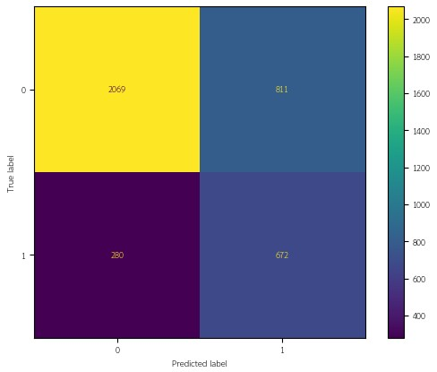

# Job Change Prediction Model
โปรเจกต์นี้เป็นการวิเคราะห์ข้อมูลเชิงสำรวจ (Exploratory Data Analysis: EDA) และสร้างโมเดล Machine Learning สำหรับการพยากรณ์การเปลี่ยนงานของพนักงาน (JobChange Prediction)
โดยใช้ข้อมูลเชิงบุคคล ระดับการศึกษา ประสบการณ์ทำงาน ประเภทบริษัท ไปจนถึงข้อมูลเชิงพื้นที่ เช่น ดัชนีพัฒนาเมือง

---

## 🧠 **Background**
- ชุดข้อมูลประกอบไปด้วย
  - ข้อมูลการย้ายงานของพนักงาน รวมถึงปัจจัยต่าง ๆ ทั้งหมด 19,158 record
  - ตัวแปรเป้าหมาย คือ JobChange (0 = ไม่เปลี่ยนงาน, 1 = เปลี่ยนงาน) 
  - พบว่ามี class imbalance ของ JobChange อย่างชัดเจน ดังนี้ 0 = 75.07% และ 1 = 24.93%
  - ปัจจัยด้านต่าง ๆ เช่น ระดับการศึกษา (education_level) ประสบการณ์ทำงาน (experience) ความสอดคล้องของงานกับประสบการณ์ (relevant_experience) เป็นต้น
  - Data Sources ข้อมูลจาก [www.kaggle.com](https://www.kaggle.com/datasets/arashnic/hr-analytics-job-change-of-data-scientists)

---

## 🧠 **Problem Statement**
องค์กรจำนวนมากมีอัตราการลาออกของพนักงานสูง ซึ่งส่งผลให้เกิดต้นทุนด้านการสรรหา การอบรม และสูญเสียผลผลิตอย่างมีนัยสำคัญ 
การคาดการณ์ความเป็นไปได้ที่พนักงานจะเปลี่ยนงานล่วงหน้าจึงเป็นสิ่งสำคัญต่อการวางแผนด้านทรัพยากรบุคคลและกลยุทธ์การรักษาพนักงาน (Retention Strategy)

---

## 🎯 **Objectives/SMART Objectives**
**Objectives**
1. ทำความสะอาดข้อมูลและจัดเตรียมข้อมูลให้พร้อมสำหรับการสร้างโมเดล
2. วิเคราะห์คุณสมบัติของข้อมูลและความสัมพันธ์ของการเปลี่ยนงานของพนักงาน
3. ทดสอบสมมติฐานเพื่อประเมินปัจจัยที่มีศักยภาพในการทำนาย
4. สร้างโมเดลพื้นฐาน เช่น Logistic Regression และ SVM
5. วัดและประเมินผลโมเดลด้วย Confusion Matrix, Precision-Recall, F1 Score และ ROC‑AUC
6. เพื่อสนับสนุนการวางนโยบายหรือกลยุทธ์ในการรักษาพนักงาน 

**SMART Objectives**

พัฒนาแบบจำลองเชิงทำนายเพื่อประเมินความน่าจะเป็นในการเปลี่ยนงานของพนักงาน โดยอาศัยการวิเคราะห์ปัจจัยกำหนดที่ส่งผลต่อพฤติกรรมการย้ายงาน พร้อมดำเนินการตรวจสอบและประเมินประสิทธิภาพของแบบจำลอง
ให้แล้วเสร็จภายในระยะเวลา 1 เดือน ทั้งนี้เพื่อสนับสนุนองค์กรในการกำหนดนโยบายและกลยุทธ์ด้านการรักษาพนักงานบนพื้นฐานของหลักฐานเชิงประจักษ์ที่เชื่อถือได้

---

## 🗂️ **Data Dictionary**

| **Attribute** | **Description** | **Data Type** | **Allowed Values / Range** | **Example** |
|---|---|---|---|---|
| enrollee_id | รหัสผู้ตอบแบบสอบถาม | Nominal (Int) | >0 | 8949 |
| city | เมือง/พื้นที่ของผู้ตอบ | Nominal | city_### | city_103 |
| city_development_index | ดัชนีพัฒนาเมือง | Ratio (Float) | [0, 1] | 0.92 |
| gender | เพศ | Nominal | Male, Female, Other | Male |
| relevant_experience | มีประสบการณ์เกี่ยวข้องหรือไม่ | Binary | yes/no | yes |
| enrolled_university | สถานะการลงทะเบียนเรียน | Nominal | no_enrollment, Full time course, Part time course | no_enrollment |
| education_level | ระดับการศึกษาสูงสุด | Ordinal | Primary < High < Graduate < Masters < Phd | Graduate |
| major_discipline | สาขาวิชาหลัก | Nominal | STEM, Business Degree, Arts, Humanities, No Major, Other | STEM |
| experience | ปีประสบการณ์ทำงาน | Ratio (Int) | [0, ∞) | 5 |
| company_size | ขนาดบริษัท | Ordinal | micro < small < medium < large < enterprise < corporate | small |
| company_type | ประเภทองค์กร | Nominal | Pvt Ltd, Public Sector, NGO, Early Stage Startup, Funded Startup, Other | Pvt Ltd |
| last_new_job | ความต่างของจำนวนปีของงานเก่ากับงานปัจจุบัน | Ratio (Int) | [0, ∞) | 1 |
| training_hours | ชั่วโมงฝึกอบรม/เรียนรู้เพิ่มเติม | Ratio (Int) | [0, ∞) | 72 |
| JobChange | **Target** (0=ไม่เปลี่ยน, 1=เปลี่ยน) | Binary (Int) | {0,1} | 1 |

---

## 🔧 Data Transformation & Preprocessing

### 1. ตรวจสอบและกำหนดชนิดข้อมูล (Data Types)
  - ปรับ Data Type ให้ถูกต้อง

### 2. ปรับข้อมูลให้ง่ายต่อการใช้งาน (Feature Transformation)
#### 2.1 Attribute experience ปรับดังนี้
  - <1 = 0 และ >20 = 21
#### 2.2 Attribute company_size ปรับให้เป็น rank ดังนี้ 
  - Unknown = 0
  - <10 = 1
  - 10-49 = 2
  - 50-99 = 3
  - 100-500 = 4
  - 500-999 = 5
  - 1000-4999 = 6
  - 5000-9999 = 7
  - 10000+ = 8
  #### 2.3 Attribute last_new_job ปรับดังนี้
  - never = 0 และ >4 = 5

### 3. การจัดการ Missing Values

| Attribute            | Missing (จำนวน) | Missing (%) | Missing Type | แนวทางการจัดการ |
|---------------------|----------------:|------------:|--------------|------------------|
| **gender**          | 4,508           | 23.53%      | **MAR**      | เพิ่มหมวด **Unknown** เพื่อหลีกเลี่ยง bias |
| **enrolled_university** | 386         | 2.01%       | **MAR**      | เพิ่มหมวด **Unknown** เพื่อไม่ให้ missing ถูกตีความว่าเป็น no_enrollment |
| **education_level** | 460             | 2.40%       | **MAR**      | เพิ่มหมวด **Unknown** เพื่อคง distribution ของระดับการศึกษา |
| **major_discipline**| 2,813           | 14.68%      | **MAR**      | ถ้า education_level = Primary School, High School ตั้งเป็น **No Major** กรณีอื่น ตั้งเป็น **Unknown** |
| **experience**      | 65              | 0.34%       | **MCAR**     | เติมค่าเป็น **0 ปี** (ไม่มีประสบการณ์) |
| **company_size**    | 5,938           | 30.99%      | **MNAR**     | เพิ่มหมวด **Unknown**   |
| **company_type**    | 6,140           | 32.05%      | **MNAR**     | เพิ่มหมวด **Unknown**  |
| **last_new_job**    | 423             | 2.21%       | **MAR**      | เติมค่าด้วย **Median ตามกลุ่มประสบการณ์ (experience_group)** |

---

# 🔍 **Exploratory Data Analysis (EDA)**

## 🛠️ วิธีการวิเคราะห์
#### การตั้งกรอบสมมติฐาน (Two‑tailed Hypothesis Testing)
เพื่อทดสอบว่าปัจจัยเชิงหมวดหมู่มีความสัมพันธ์กับการเปลี่ยนงานหรือไม่ กำหนดสมมติฐานดังนี้:
  - **H₀:** ไม่มีความสัมพันธ์ระหว่างปัจจัยกับการเปลี่ยนงาน (ρ = 0)
  - **H₁:** มีความสัมพันธ์ระหว่างปัจจัยกับการเปลี่ยนงาน (ρ ≠ 0)
#### เครื่องมือทางสถิติที่ใช้ในการวิเคราะห์
- **Contingency Table (O/E)** ใช้ตรวจสอบจำนวนข้อมูลจริง (Observed) เทียบกับจำนวนที่คาดว่าจะเป็นภายใต้สมมติฐานศูนย์ (Expected)
- **Chi‑square Test of Independence** ใช้ประเมินว่าตัวแปรจัดหมวดหมู่สองตัวว่ามีความสัมพันธ์กันหรือไม่
- **p‑value (ระดับนัยสำคัญทางสถิติ)** ใช้ตัดสินว่าผลลัพธ์มีความน่าจะเป็นเกิดจากความบังเอิญภายใต้ H₀ หรือไม่
- **Cramér’s V (ขนาดความสัมพันธ์ / Effect Size)** ใช้วัดความแรงของความสัมพันธ์ที่พบ
#### เครื่องมือที่ใช้ในการประมวลผล
ใช้ Python สำหรับ
- การสร้าง Contingency Table
- การคำนวณค่า Chi‑square
- ค่า p‑value
- ค่าความสัมพันธ์ Cramér’s V
- Point-biserial Correlation
- การสร้าง Visualization เพื่อแสดงผลลัพธ์ (Matplotlib / Seaborn)

#### ตารางสรุปค่าความสัมพัมธ์ของแต่ละปัจจัย เทียบกับ การเปลี่ยนงาน
| Feature                  | Type          | Chi-square | df | p-value       | Cramer's V | N      | Point-biserial r | p-value (r)    |
|--------------------------|---------------|-----------:|---:|--------------:|-----------:|-------:|-----------------:|---------------:|
| gender                   | Categorical   | 117.377    |  3 | 2.833e-25     | 0.0783     | 19158  | N/A              | N/A            |
| relevant_experience      | Categorical   | 315.339    |  1 | 1.501e-70     | 0.1283     | 19158  | N/A              | N/A            |
| enrolled_university      | Categorical   | 463.534    |  3 | 3.809e-100    | 0.1555     | 19158  | N/A              | N/A            |
| education_level          | Categorical   | 167.271    |  5 | 2.787e-34     | 0.0934     | 19158  | N/A              | N/A            |
| major_discipline         | Categorical   | 65.027     |  6 | 4.259e-12     | 0.0583     | 19158  | N/A              | N/A            |
| experience_group         | Categorical   | 598.073    |  3 | 2.637e-129    | 0.1767     | 19158  | N/A              | N/A            |
| company_size             | Categorical   | 1161.958   |  8 | 1.587e-245    | 0.2463     | 19158  | N/A              | N/A            |
| company_type             | Categorical   | 959.830    |  6 | 4.352e-204    | 0.2238     | 19158  | N/A              | N/A            |
| city_development_index   | Numeric       | N/A        | N/A| N/A           | N/A        | 19158  | -0.3417          | ~0             |
| experience (years)       | Numeric       | N/A        | N/A| N/A           | N/A        | 19158  | -0.1769          | 1.838e-134     |
| last_new_job             | Numeric       | N/A        | N/A| N/A           | N/A        | 19158  | -0.0849          | 5.167e-32      |
| training_hours           | Numeric       | N/A        | N/A| N/A           | N/A        | 19158  | -0.0216          | 2.820e-03      |

#### 📑 Hypothesis Testing
| ลำดับ | ปัจจัย                   | H₀ (Null Hypothesis)                               | H₁ (Alternative Hypothesis)                        | วิธีทดสอบ            | ผล (α = 0.05) |
|------:|---------------------------|----------------------------------------------------|----------------------------------------------------|----------------------|---------------|
| 1     | gender                    | เพศ **ไม่สัมพันธ์** กับการเปลี่ยนงาน            | เพศ **สัมพันธ์** กับการเปลี่ยนงาน                | Chi‑square           | **ปฏิเสธ H₀** (p ≈ 2.83×10⁻²⁵) |
| 2     | relevant_experience       | ประสบการณ์ที่เกี่ยวข้อง **ไม่สัมพันธ์** กับการเปลี่ยนงาน | ประสบการณ์ที่เกี่ยวข้อง **สัมพันธ์** กับการเปลี่ยนงาน | Chi‑square           | **ปฏิเสธ H₀** (p ≈ 1.50×10⁻⁷⁰) |
| 3     | enrolled_university       | สถานะการศึกษาต่อ **ไม่สัมพันธ์** กับการเปลี่ยนงาน | สถานะการศึกษาต่อ **สัมพันธ์** กับการเปลี่ยนงาน | Chi‑square           | **ปฏิเสธ H₀** (p ≈ 3.81×10⁻¹⁰⁰) |
| 4     | education_level           | ระดับการศึกษา **ไม่สัมพันธ์** กับการเปลี่ยนงาน   | ระดับการศึกษา **สัมพันธ์** กับการเปลี่ยนงาน     | Chi‑square           | **ปฏิเสธ H₀** (p ≈ 2.79×10⁻³⁴) |
| 5     | major_discipline          | สาขาที่จบ **ไม่สัมพันธ์** กับการเปลี่ยนงาน       | สาขาที่จบ **สัมพันธ์** กับการเปลี่ยนงาน         | Chi‑square           | **ปฏิเสธ H₀** (p ≈ 4.26×10⁻¹²) |
| 6     | company_size              | ขนาดของบริษัท **ไม่สัมพันธ์** กับการเปลี่ยนงาน   | ขนาดของบริษัท **สัมพันธ์** กับการเปลี่ยนงาน     | Chi‑square           | **ปฏิเสธ H₀** (p ≈ 1.59×10⁻²⁴⁵) |
| 7     | company_type              | ประเภทของบริษัท **ไม่สัมพันธ์** กับการเปลี่ยนงาน | ประเภทของบริษัท **สัมพันธ์** กับการเปลี่ยนงาน   | Chi‑square           | **ปฏิเสธ H₀** (p ≈ 4.35×10⁻²⁰⁴) |
| 8     | city_development_index    | ดัชนีการพัฒนาเมือง **ไม่สัมพันธ์** กับการเปลี่ยนงาน | ดัชนีการพัฒนาเมือง **สัมพันธ์** กับการเปลี่ยนงาน | Point‑biserial       | **ปฏิเสธ H₀** (p ≈ 0) |
| 9     | experience                | ประสบการณ์การทำงาน **ไม่สัมพันธ์** กับการเปลี่ยนงาน | ประสบการณ์การทำงาน **สัมพันธ์** กับการเปลี่ยนงาน | Point‑biserial | **ปฏิเสธ H₀** (r‑p ≈ 1.84×10⁻¹³⁴) |
| 10    | last_new_job              | ระยะเวลางานล่าสุด **ไม่สัมพันธ์** กับการเปลี่ยนงาน | ระยะเวลางานล่าสุด **สัมพันธ์** กับการเปลี่ยนงาน | Point‑biserial | **ปฏิเสธ H₀** (r‑p ≈ 5.17×10⁻³²) |
| 11    | training_hours            | ชั่วโมงฝึกอบรม **ไม่สัมพันธ์** กับการเปลี่ยนงาน  | ชั่วโมงฝึกอบรม **สัมพันธ์** กับการเปลี่ยนงาน    | Point‑biserial       | **ปฏิเสธ H₀** (p ≈ 2.82×10⁻³)|

---

# Feature Selection
จากการวิเคราะห์ข้อมูลทั้งหมด ในการหาค่าความสัมพันธ์ของปัจจัยต่าง ๆ โดยใช้เครื่องมือ Chi-square และ Cramer's V สำหรับข้อมูลประเภท Categorical และ Point-biserial Correlation สำหรับข้อมูลประเภท Numeric 
พบว่าสามารถแบ่งปัจจัยทั้งหมดออกได้เป็น 3 กลุ่ม ดังนี้

🥇 ตัวแปรที่มี “อิทธิพลระดับสูงมาก” กับการเปลี่ยนงาน (ตามขนาดเอฟเฟกต์)
- company_size Cramér’s V = 0.246 มีนัยสำคัญสูงมาก (χ²=1161.96, p≈1.59×10⁻²⁴⁵)
- company_type Cramér’s V = 0.224 มีนัยสำคัญสูงมาก (χ²=959.83, p≈4.35×10⁻²⁰⁴)
- city_development_index (CDI) มีนัยสำคัญสูงมาก Point‑biserial r = −0.342

🥈 ตัวแปรที่มี “อิทธิพลระดับสูง”
- experience มีนัยสำคัญสูง Point‑biserial r = −0.177
- enrolled_university Cramér’s V = 0.156 มีนัยสำคัญสูง (χ²=463.53, p≈3.81×10⁻¹⁰⁰)
- relevant_experience Cramér’s V = 0.128 มีนัยสำคัญสูง ²=315.34, p≈1.50×10⁻⁷⁰) 

🥉 ตัวแปรที่มี “อิทธิพลระดับปานกลาง”
- education_level Cramér’s V = 0.093 มีนัยสำคัญ (χ²=167.27, p≈2.79×10⁻³⁴)
- gender Cramér’s V = 0.078 มีนัยสำคัญ (χ² p≈2.83×10⁻²⁵)
- major_discipline Cramér’s V = 0.058 มีนัยสำคัญ (χ² p≈4.26×10⁻¹²)
- last_new_job มีนัยสำคัญ Point‑biserial r = −0.085
- training_hours มีนัยสำคัญ Point‑biserial r = −0.022

---

# 🌐 Modeling Methodology
## 🧠 Model Type
 - **Supervised Learning:** ประเภท Binary Classification
 - **Target Label:** ไม่เปลี่ยนงาน (0) และ เปลี่ยนงาน (1)
 - **Primary Features:** company_size, company_type, city_development_index, experience, enrolled_university, relevant_experience
 - **Secondary Features:** education_level, gender, major_discipline, last_new_job, training_hours

---

### 🧩 Chosen Model
 - **Logistic Regression** เหมาะกับ Binary Classification เพราะตีความง่าย และรองรับการปรับ Class Weight
 - **SVM** แยก boundary ของ class แบบชัดเจน ทำงานได้ดีในข้อมูลที่ feature interaction มีความซับซ้อน และรองรับการปรับ Class Weight

---

### 🧮 Encoding
```python 
# 1. company_type
dataset['company_type'] = dataset['company_type'].map({
    'unknown':0,
    'Other':1,
    'NGO':2,
    'Public Sector':3,
    'Early Stage Startup':4,
    'Funded Startup':5,
    'Pvt Ltd':6 })

 # 2. enrolled_university
dataset['enrolled_university'] = dataset['enrolled_university'].map({
    'unknown': 0,
    'no_enrollment': 1,
    'Part time course': 2,
    'Full time course': 3 })

# 3. relevent_experience
dataset['relevent_experience'] = dataset['relevent_experience'].map({
    'No relevent experience':0,
    'Has relevent experience':1 })

# 4. education_level
dataset['education_level'] = dataset['education_level'].map({
    'unknown':0,
    'Primary School':1,
    'High School':2,
    'Graduate':3,
    'Masters':4,
    'Phd':5 })

# 5. gender
dataset['gender'] = dataset['gender'].map({
    'unknown': 0,
    'Male': 1,
    'Female': 2,
    'Other': 3 })

# 6. major_discipline
dataset['major_discipline'] = dataset['major_discipline'].map({
    'unknown':0,
    'STEM':1,
    'Business Degree':2,
    'Arts':3,
    'Humanities':4,
    'No Major':4,
    'Other':6 })
```
---

### ✂️ Train/Test Split
 ```python
from sklearn.model_selection import train_test_split
X = dataset.drop('target', axis=1)
y = dataset['target']
X_train, X_test, y_train, y_test = train_test_split(X, y,test_size=0.2,random_state=42)
```
- ขนาดชุด Train: (15326, 11)
- ขนาดชุด Test : (3832, 11)

---

### ⚖️ Scaling
```python
from sklearn.preprocessing import StandardScaler
scaler = StandardScaler()
X_train_scaled = scaler.fit_transform(X_train)
X_test_scaled = scaler.transform(X_test)
```

---

**🤖 Model: Logistic Regression**
```python
from sklearn.model_selection import GridSearchCV
from sklearn.linear_model import LogisticRegression
param_grid = {
    'penalty': ['l1','l2'],
    'solver': ['liblinear']}
model = GridSearchCV(
    LogisticRegression(max_iter=1000, class_weight='balanced'), param_grid, cv=5, scoring='f1')
model.fit(X_train_scaled, y_train)

y_pred = model.predict(X_test_scaled)
y_prob = model.predict_proba(X_test_scaled)[:,1]
```
---

**🔢Confusion Matrix**
```python
from sklearn.metrics import confusion_matrix, ConfusionMatrixDisplay
cm = confusion_matrix(y_test, y_pred)
disp = ConfusionMatrixDisplay(confusion_matrix=cm)
disp.plot()
plt.show()
```



---

**📊 Classification Report**
```python
from sklearn.metrics import classification_report
print(classification_report(y_test, y_pred))
```
|    | ✅ Precision | 🔍 Recall | ⚖️ F1-Score | 💾 Support |
|--------------|:-----------:|:--------:|:----------:|:---------:|
| ไม่เปลี่ยนงาน   | 0.88      | 0.72  | 0.79     | 2880     |
| เปลี่ยนงาน     | 0.45      | 0.71   | 0.55     | 952     |
| Accuracy     |           |        | **0.72**     | 3832    |
| Macro Avg    | 0.67      | 0.71   | 0.67     | 3832    |
| Weighted Avg | 0.77      | 0.72   | 0.73     | 3832    |

**💾 Support:** จำนวนตัวอย่างในแต่ละคลาส
- ไม่เปลี่ยนงาน (0) = 2880 (%)
- เปลี่ยนงาน (1) = 952 (%)
- รวม = 3832

**🔥 Accuracy:** สัดส่วนของการทำนายถูกทั้งหมด
- 0.76 → โมเดลทำนายถูกต้อง 76% ของข้อมูลทั้งหมด (5748 ตัวอย่าง)

**✅ Precision** (สัดส่วนของการทำนายคลาสนั้นที่ถูกต้องจริง):
- ไม่เปลี่ยนงาน(0): 0.87 → ในกลุ่มที่โมเดลทำนายว่า **“สูง”** มี 87% ที่ถูกต้องจริง
- เปลี่ยนงาน(1): 0.92 → ในกลุ่มที่ทำนายว่า **“ต่ำ”** มี 92% ที่ถูกต้องจริง

**🔍 Recall** (ในกลุ่มที่เป็นคลาสนั้นจริง โมเดลจับได้ครบแค่ไหน)
- ไม่เปลี่ยนงาน(0): 0.75 → โมเดลจับได้ 75% ของกลุ่มสูงจริง
- เปลี่ยนงาน(1): 0.96 → โมเดลจับได้ 96% ของกลุ่มต่ำจริง

**⚖️ F1-Score:** (ค่ากลางระหว่าง Precision และ Recall)
- ไม่เปลี่ยนงาน(0): 0.81 → ปานกลาง (เพราะ Recall ต่ำกว่า Precision)
- เปลี่ยนงาน(1): 


Accuracy: 0.7627000695894224
Precision: 0.5619469026548672
Recall: 0.26312154696132595
F1 Score: 0.3584195672624647
ROC AUC: 0.754389053064371


